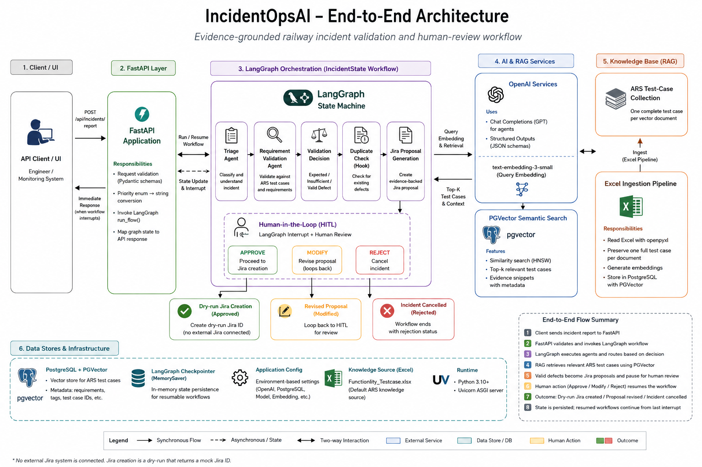
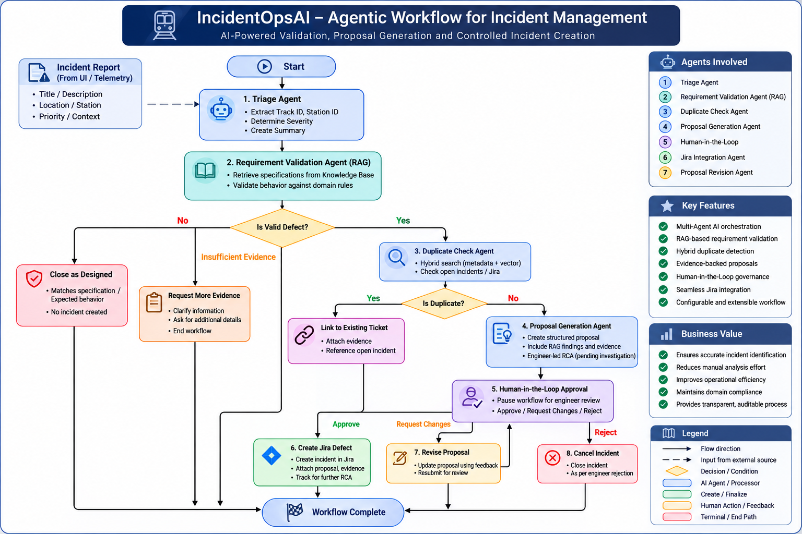
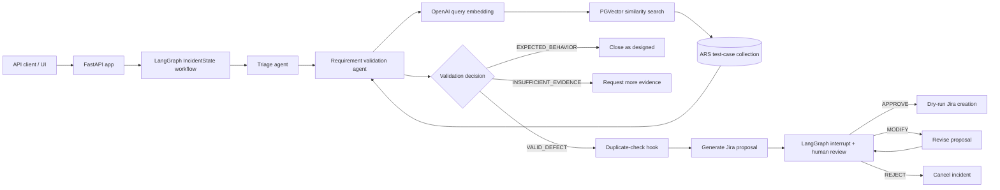
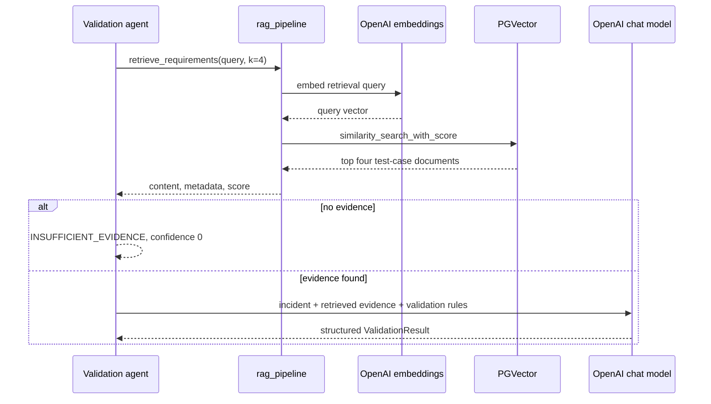
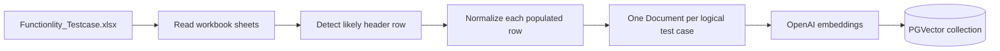

# IncidentOpsAI

**Evidence-grounded railway incident validation and human-review workflow**

[](https://www.python.org/)
[](https://fastapi.tiangolo.com/)
[](https://www.langchain.com/langgraph)
[](https://platform.openai.com/)
[](https://github.com/pgvector/pgvector)

IncidentOpsAI is a proof-of-concept API for validating railway CTC/Automatic
Route Setting (ARS) incident reports against functional test-case evidence. A
FastAPI endpoint accepts an incident, a LangGraph workflow triages it, and a
RAG validation agent retrieves relevant ARS test cases from PGVector before
classifying the report as a valid defect, expected behavior, or insufficient
evidence.

Valid defects are converted into an evidence-backed Jira proposal and paused
for a human engineer. The engineer can approve, modify, or reject the proposal.
Approval currently creates a dry-run Jira ID; no external Jira system is
connected.

## High-Level Architecture

### IncidentOpsAI Architecture Diagram

The architecture diagram presents the complete system context. API clients send
incident reports to the FastAPI service, which delegates processing to the
LangGraph orchestration layer. The agents use OpenAI chat and embedding models,
retrieve authoritative ARS test-case evidence from PostgreSQL/PGVector, and
expose paused proposals through the human-review API. Configuration and the
Excel-to-PGVector ingestion path support these runtime components.



*Figure 1: IncidentOpsAI system architecture and component interactions.*

### Agentic AI Workflow

The agent workflow diagram focuses on the internal control flow implemented by
`incidentops_graph.py`. It follows an incident from LLM-based triage through
RAG-backed requirement validation and conditional routing. Valid defects proceed
to proposal generation and a LangGraph human-in-the-loop interrupt; an engineer
can approve the proposal, request a revision and review it again, or reject it.
Approved proposals currently end in dry-run Jira creation.



*Figure 2: IncidentOpsAI LangGraph agent orchestration and human-in-the-loop workflow.*

### Simplified Runtime Flow

The Mermaid view below provides a compact, text-rendered summary of how the API,
agents, OpenAI models, and PGVector knowledge base interact at runtime:



## Key Capabilities

- Validated FastAPI request and response contracts for operational incidents.
- LangGraph state machine with conditional routing and resumable human review.
- Structured OpenAI outputs for triage, requirement validation, proposal
  generation, and proposal revision.
- ARS knowledge ingestion from Excel, preserving one complete test case per
  vector document.
- Semantic retrieval from PostgreSQL/PGVector using OpenAI embeddings.
- Evidence-constrained validation with test-case and requirement traceability.
- Non-blocking HITL flow: the report request returns when the graph interrupts,
  and a later review request resumes the same graph thread.

## Tech Stack

| Layer | Technology |
| --- | --- |
| API | FastAPI, Pydantic, Uvicorn |
| Agent orchestration | LangGraph, in-memory `MemorySaver` |
| LLM | LangChain OpenAI `ChatOpenAI` |
| Embeddings | OpenAI `text-embedding-3-small` by default |
| Knowledge store | PostgreSQL, PGVector, `langchain-postgres` |
| Knowledge source | Excel workbook read with `openpyxl` |


## Code Flow

### 1. API request and validation (`app/app.py`)

`POST /api/incidents/report` validates four fields with Pydantic:

- `title`: 5–200 characters
- `description`: 20–5000 characters
- `location`: 2–200 characters
- `priority`: `Low`, `Medium`, `High`, or `Critical`

The handler converts the priority enum to a string and calls `run_flow()`. It
then maps graph state fields such as the validation decision, matched test case,
confidence, stage, and status into `IncidentReportResponse`.

### 2. Workflow initialization (`run_flow`)

`run_flow()`:

1. Generates an `INC-XXXXXXXX` identifier unless one was supplied.
2. Adds a UTC creation timestamp and initializes `IncidentState`.
3. uses the incident ID as the LangGraph `thread_id`.
4. Invokes the compiled graph asynchronously.
5. If execution pauses at HITL, normalizes the result to
   `pending_human_review` and adds a summary to the in-memory review queue.

### 3. Triage agent

The first node sends the canonical incident text to the configured OpenAI chat
model and requests a structured `TriageResult`. It extracts only identifiers
explicitly present in the report (`station_id`, `track_id`, and `train_id`),
assigns severity, and creates a factual one-sentence summary.

### 4. RAG requirement validation

The validation node builds a retrieval query from the triage summary (falling
back to the original incident text) and runs the synchronous PGVector retrieval
in a worker thread so the async workflow is not blocked.



The LLM must return one of:

| Decision | Meaning | Next step |
| --- | --- | --- |
| `VALID_DEFECT` | Observed behavior contradicts explicit expected behavior. | Duplicate check, then proposal generation. |
| `EXPECTED_BEHAVIOR` | Observed behavior matches the retrieved requirement. | Close as designed. |
| `INSUFFICIENT_EVIDENCE` | The report or retrieved test cases cannot prove either outcome. | Stop at `needs_more_evidence`. |

The prompt instructs the model to use only retrieved evidence, not invent
missing facts, and copy the matched test-case ID and requirement section from
that evidence.

### 5. Defect proposal and HITL

For a valid defect, the duplicate-check node currently continues as
non-duplicate because no open-ticket repository is connected. The proposal
agent creates structured Jira-ready content without speculating about root
cause. RCA remains marked as pending engineering investigation.

`hitl_approval_node()` calls LangGraph `interrupt()`. The HTTP report request
returns at this point; it does not wait for an engineer. Pending review endpoints
read from a lightweight in-memory queue.

### 6. Workflow resume

`POST /api/incidents/{incident_id}/review` validates the review and calls
`resume_flow()`, which resumes the exact LangGraph thread with a `Command`:

- `APPROVE` routes to the Jira tool node and produces `JIRA-DRYRUN-XXXXXX`.
- `MODIFY` requires feedback, revises and versions the proposal, then interrupts
  again for another review.
- `REJECT` terminates the workflow with status `rejected`.

Completed or rejected incidents are removed from the pending-review queue.

## RAG Ingestion Flow

Ingestion is an offline/deployment action, not part of incident submission.



Each document keeps the scenario, preconditions, execution steps, and expected
behavior together. Metadata includes the source workbook, sheet, Excel row,
test-case ID, requirement section, and document type. This is deliberate: generic
character chunking could separate a condition from its expected result.

The collection defaults to `incidentops_kb_docs` and can be overridden with
`INCIDENTOPS_ARS_COLLECTION`.

## API Endpoints

Local base URL: `http://127.0.0.1:8000`

| Method | Endpoint | Purpose |
| --- | --- | --- |
| `GET` | `/health` | Service health check. |
| `POST` | `/api/incidents/report` | Start incident triage and validation. |
| `GET` | `/api/incidents/pending-reviews` | List incidents awaiting an engineer. |
| `GET` | `/api/incidents/pending-reviews/{incident_id}` | Get one review record. |
| `POST` | `/api/incidents/{incident_id}/review` | Approve, modify, or reject a paused proposal. |

Interactive OpenAPI documentation is available at `/docs` after startup.

### Report an incident

```bash
curl -X POST http://127.0.0.1:8000/api/incidents/report \
  -H "Content-Type: application/json" \
  -d '{
    "title": "Automatic route setting continued without Train ID",
    "description": "Train 1001 occupied the target control track. No Train ID was present, but automatic route setting continued and no alarm was generated.",
    "location": "Station A",
    "priority": "High"
  }'
```

For a validated defect, the response has `status: "pending_human_review"` and
contains the matched test case, requirement section, confidence, and current
stage. Expected behavior and insufficient evidence return terminal statuses
immediately.

### Review a proposal

```bash
curl -X POST http://127.0.0.1:8000/api/incidents/INC-12345678/review \
  -H "Content-Type: application/json" \
  -d '{"decision": "APPROVE", "feedback": "Reviewed by signalling engineer"}'
```

To modify a proposal, use `"decision": "MODIFY"` and provide non-empty
`feedback`. `REJECT` ends the incident without creating a dry-run Jira ID.

## Setup and Run

### Prerequisites

- Python 3.10 or newer
- A PostgreSQL instance with the PGVector extension
- An OpenAI API key
- The ARS workbook at `app/rag/kb_docs/Functionlity_Testcase.xlsx` (or a custom
  path passed to ingestion)

### 1. Install dependencies

```bash
python -m venv .venv
source .venv/bin/activate
pip install -r requirements.txt
```

Although `POSTGRES_CONNECTION` is not used by the active RAG path, it is a
required configuration field when `app.core.config.Settings` is constructed.

### 3. Ingest the ARS knowledge base

Run once initially, and again when the workbook changes:

```bash
python -m app.rag.rag_pipeline --ingest --recreate
```

Omit `--recreate` to append documents. Optional flags are `--xlsx` for another
workbook and `--collection` for another PGVector collection.

### 4. Start the API

```bash
uvicorn app.app:app --reload --host 0.0.0.0 --port 8000
```

## Current POC Boundaries

- `MemorySaver` checkpoints and the pending-review dictionary are in memory.
  They are lost on restart and are not shared across multiple API workers.
- Duplicate detection is a safe placeholder that always reports
  `is_duplicate = false`; no Jira/open-incident index is queried.
- Jira integration is a dry run. Approval generates an identifier but performs
  no external write.
- Root-cause analysis is deliberately human-led and is not inferred by the LLM.
- Retrieval is dense PGVector similarity search only. The disconnected generic
  hybrid/BM25 modules are not part of this runtime flow.
- The API has CORS configuration but no authentication or authorization layer.
- The repository currently contains no automated test suite for this workflow.

For production use, replace in-memory persistence with a durable LangGraph
checkpointer and review store, connect an incident/ticket repository for
duplicate search, add authenticated reviewer access, integrate Jira, and add
unit/integration tests around every routing branch.

